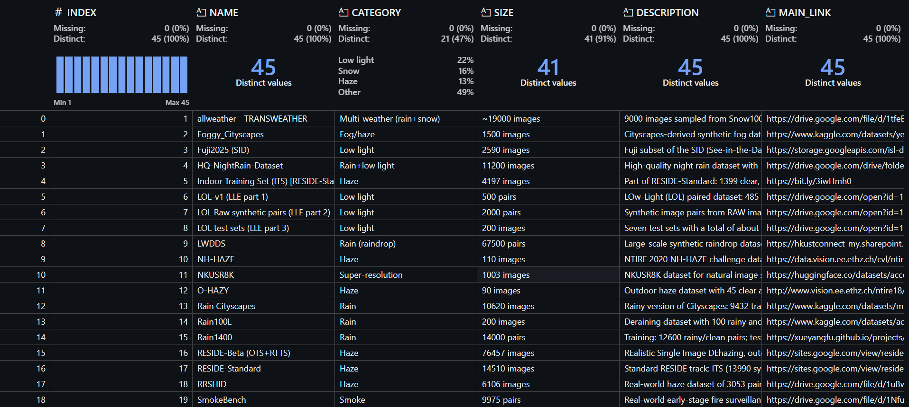

# Adverse Weather & Low-Light Vision Datasets

A curated, unified index of public **fog, haze, smoke, rain, snow, and low-light** image datasets for computer vision research. This repository is intended as a single, consistent reference for discovering and programmatically accessing datasets used in image restoration, enhancement, and robust perception under adverse conditions.

---

## Overview

The core of this repository is a normalized CSV file:

datasets.csv

with the schema:

INDEX, NAME, CATEGORY, SIZE, DESCRIPTION, MAIN_LINK


All datasets are mapped to this schema so downstream code can operate without dataset-specific assumptions or ad-hoc parsing.

---

## Repository Contents

- datasets.csv — master dataset registry with IDs, categories, descriptions, sizes, and official links  
- loaders/registry.py — lightweight Python registry for querying dataset metadata  
- README.md — documentation (this file)

The structure is intentionally minimal and designed to scale.

---

## Dataset Taxonomy

Each dataset is tagged with a CATEGORY to enable fast filtering.

| CATEGORY              | DATASETS |
|-----------------------|----------|
| Haze / Fog      | Foggy Cityscapes, O-HAZY, NH-HAZE, RESIDE-Standard, RESIDE-Beta, HazeSpace2M, Haze1K, RS-Haze, Foggy Zurich, SynthRSF, NTIRE Nighttime Dehazing |
| Snow            | Snow100K, SnowCityScapes, SnowKITTI2012, SRRS, CSD, SITD, NTIRE Desnowing |
| Rain            | Rain100L, Rain1400, Rain Cityscapes, HQ-NightRain, LWDDS, WeatherBench |
| Smoke           | SmokeBench (surveillance), LSD3K (medical / endoscopic) |
| Low-Light       | LOL (v1, v2), SID (Sony, Fuji, Full), ExDark, LLVIP, LoLI-Street, SICE, LIME, DPED, LoL-SRW |
| MultiWeather   | allweather-TRANSWEATHER, WeatherBench, MCASD |

All entries are normalized into the same CSV format for consistent downstream usage.


## Using the Dataset Registry

Example Python usage:

```python
from loaders.registry import DatasetRegistry

reg = DatasetRegistry("datasets.csv")

meta = reg.get(1)
print(meta["NAME"])
print(meta["CATEGORY"])
print(meta["SIZE"])
print(reg.link(1))

snow = reg.get_by_name("Snow100K")
print(snow["INDEX"], snow["MAIN_LINK"])

for row in reg.list_all():
    print(reg.pretty(row["INDEX"]))

```

The CSV remains the single source of truth; the registry is only a thin lookup layer.

## Intended Use

This repository supports:

Training and benchmarking dehazing, deraining, desnowing, desmoking, and low-light enhancement models

Cross-weather and multi-domain generalization studies

Joint tasks such as dehaze + low-light or restoration + detection

Robust perception research under adverse environmental conditions

Remote sensing under atmospheric degradation

## Project History

This repository originates from the Sarvadrushti research initiative, which began in early 2024 as an exploration of situational awareness and robust computer vision under adverse conditions.

During its active development phase, the work was conducted under institutional oversight, incubation review cycles, and external evaluations. Due to confidentiality and evaluation constraints, intermediate code and artifacts were not publicly released.

Following the conclusion of evaluations and internal reviews, the dataset index and supporting tooling have been consolidated, cleaned, and released publicly as a research artifact. The Git history reflects the open-source release timeline and does not represent the original inception date of the research.

### Project status: Completed / Archived.

## Licenses and Citation

This repository does not host datasets. Each entry links to the official source; users must verify licenses and citation requirements before use. When using a dataset, cite the original paper or benchmark.

If referencing this collection as a whole, you may cite it as:

“We use the Adverse Weather & Low-Light Dataset Collection, which aggregates public datasets for fog, haze, rain, snow, smoke, and low-light vision research.”

## Contributors

This repository was developed as part of the Sarvadrushti research initiative.

## Core contributors:

V S Chandradithya Janaswami — dataset curation, vision research

Sarvadrushti Research Team — experimentation, evaluation, and review